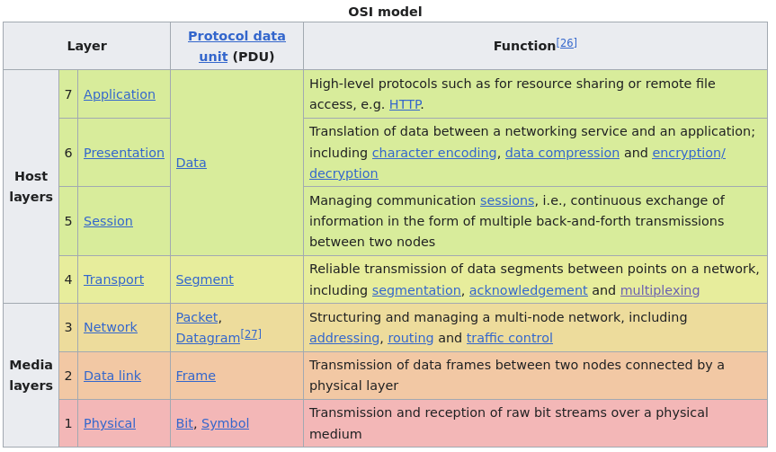

# Containerization

## Single concern principle

Explain the principle of "one application per container." Why is this considered a best practice, and what issues can arise if you run multiple applications inside a single container?

- Why is it best practice ?
  - **Single concern:** each container is responsible for a single application and its dependancies and volume, which allows to limit incompatibilites and conflicts.
    - *Example*:
      - two applications need the same library, but different versions.\
      - or they need to access the same file, which could lead to data loss or corruption.
  - **Scalability:** makes it really easy to reuse a container should you need to, whether for the same cluster or for another project.
    - *Example*:
      - if your nginx container only runs nginx, you can spawn more if your site traffic suddenly increases. This is not possible if you run MariaDB within that same container.
  - **Isolation and ressource management:** each container can be limited in ressources (memory, computing power) to ensure all applications and processes are fairly distributed.
  - **Efficiency**: running a single application per container limits image size, which allows for shorter build and deployment time.

- Issues with multiple application containers
  - Running different apps in the same container might also create conflict within the filesystem, with one app overwriting the output of another.
  - Makes it harder to track and monitor issues, since all the apps will log to the same output.

Ressource: [Single concern approach](https://www.baeldung.com/ops/one-process-per-container#5-testing-and-debugging)

## Statefullness VS statelessness

Describe the differences between a stateless and a stateful container. How does this distinction affect your approach to data persistence and backup strategies in production?

- A **stateless** container will not store data regarding its execution for the next time it runs. They are completely independant, which makes them easy to replace and scale. They are well suited for microservice deployements, REST APIs...
- A **statefull** container will do that, retaining information about itself inbetween executions. A good example of that is the database that stores informations generated by the microservices.

Stateless containers are inherently easier to deploy and maintain, since they rely on external data exclusively.

While statelessness is the default behavior for containers (a process pops up, runs some operations, then disappears without a trace), the increasing use of containerization called for a way to retain information. This sparked the implementation of **volumes** and **mounts** in Docker and other containerization technologies.

Deciding wether your containers need to be statefull or stateless is a case by case scenario, where you adapt your approach to the application being contenairized.

## Security

Discuss how you would minimize the attack surface of a Docker image. What specific steps would you take during image creation to enhance security and efficiency?

- Avoid running in root to avoid user priviledge escalation;
  - For containers that need to run root, use usernamespace to ensure that a user escaping a container will not be able to run root on the host.
- Do not expose containers that do not need to be exposed;
- Limit image size and dependancies: the less surface you have, the less vulnerable the container;
- Limit container connectivity by defining your own network, and never using `host` as a network, as it grants access to the host network for the containers. In the same way, be mindful about connecting containers: not every container need to be on the same network.
- Apply the least-priviledge principle: if your container only needs to read from files, specify the image to be read-only.

## Best practices

### Networking

Docker offer the option to use *networks* to link containers together. The containers on the same network gain the ability to communicate through service names (*ie*: `mariadb:3006`) instead of by IP.

A deprecated way to incur this behavior was with the `--link` directive. This allowed to connect containers, enabling environemment sharing. It is not recommended to use anymore, as it became cumbersome to manage (hard-linking containers between them) and posed a security threat (leaking environnement variables, lack of communication control between containers...)

The default network on Docker is a **bridge network**. It's recommended to use a user-defined bridge network to ensure full functionnality.

To better understand the following explainations, we need a refresher on [the OSI networking model](https://en.wikipedia.org/wiki/OSI_model).

#### OSI Network model layers

### Bridge networks

In general, a bridge network (simply *bridge*) is a device or software that allows segmented parts of a **local** network to become assembled, forming a single and larger network.

It ressembles a router, except that it operates on the **second layer** of the OSI model, meaning that it uses MAC address (the Media Access Control Address, which is a unique hardware component used to identify a network interface), instead of IP addresses as would a router.

In the context of Docker, the bridge network is a virtual implementation of that concept. Its main purpose is to allow containers to communicates with others on the same network, all the while providing an isolation layer from the host.
