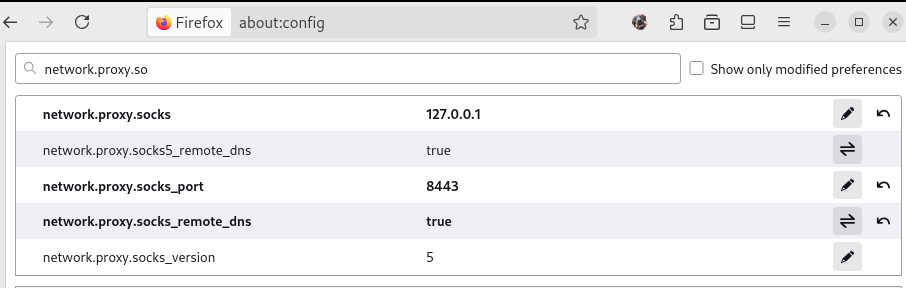

# Set up a SOCKS5 proxy for Firefox

## Firefox configuration

Setting up a proxy on Firefox is pretty straightforward:

1. In Firefox, type `about:preferences#general` in the navigation bar and look for Network settings.
2. Since we don't want to redirect *all* my traffic to the localhost of my virtual machine, let's check `Automatic proxy configuration URL`. Here, you have to put the path to a `.pac` configuration file. Here's an example of the contents for such a file:

> PAC stands for Proxy Auto-Configuration.

```js
//  this is JavaScript - .pac files must be written in JavaScript
// since they are executed by the browser JavaScript engine.

// FindProxyForURL is a browser defined function which is called
// when a browser evaluates proxy settings.

function FindProxyForURL(url, host) {
  if (host === "<login>.42.fr" || host === "www.<login>.42.fr") {
  // If the passed host is our website, we redirect the request
  // to the SOCKS5 proxy we setup with ssh -D
    return "SOCKS5 <localhost>:<port>";
  }
  // otherwise we straight up ignore the request and bypass the proxy
  return "DIRECT";
}
```

Save that file somewhere and put the path to your `.pac` in the box, like so:


Make sure to tick `proxy DNS when using SOCKS v5`, which is litterally the entire point of using a proxy for Inception (it allows [DNS](https://en.wikipedia.org/wiki/Domain_Name_System) to happens remotely, instead of on the host).

You might need to visit `about:config` in Firefox and set `network.proxy.socks_remote_dns` to `true` in order for it to work; I know I had to, but it seems to be optionnal. Here are my settings: 

## Setting up the proxy

Now you need to actually up the proxy to which your requests will be redirected. To do that, just do:

```sh
  ssh -D <port> <user>@<remote-machine-ip>
```

This creates a SOCKS5 proxy on your specified host port, which will tunnel your requests to your VM.

As long as your VM is up, the traffic to your specified URL will be redirected to your VM, and your website will work !

## An example

> The default port for SOCKS5 proxy forwarding is 9999. You can pick any you like, but make sure that the port isn't already mapped on your host.

If your `.pac` file is as follows:

```js
function FindProxyForURL(url, host) {
  if (host === "<login>.42.fr" || host === "www.<login>.42.fr") {
    return "SOCKS5 127.0.0.1:9999";
  }
  return "DIRECT";
}
```

Then you should create your proxy with:

```sh
  ssh -D 9999 <user>@<remote-machine-ip>
```

The most important thing is that the proxy ports match !